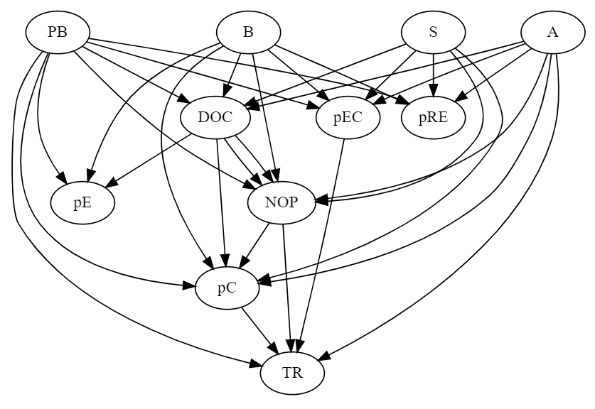

# Bayesian Analysis of BART
In this project, I used a variety of modeling approaches to conduct a comprehensive analysis of Balloon Analogue Risk Task (BART) cognitive test. I used PyMC to design and implement a variety of Bayesian models including Bayesian Linear models, Bayesian Non-linear models, Bayesian Mutli-level Models, and Bayesian Gaussian processes. Below, you can find a short summary of the BART dataset and it's design of the experiment.

## Balloon Analogue Risk Task Intro

The Balloon Analogue Risk Task (BART) is widely-used to measure risk propensity. Participants are shown a balloon on a computer screen which they can pump with a keypress to increase their reward. But, there's a risk of balloon bursting (leading to loss of the reward). So, they need to bank (cash-in) to increase the total reward. One sample design of BART could be found [here](https://www.unipark.de/uc/testothek/?a=bart).

The data for this project is from an experiment where researchers were interested in the effects of alcohol consumption on risk taking. The experiment was a within-subjects design, where each participant were administered three different doses of alcohol before they're presented with BART. There were also three different probabilities for balloon bursts in three different blocks which consisted of 30 trials each. These blocks were given in random order, and subjects were informed about the burst probability values prior to each block. The gain with each pump was a percentage of the money gained so far.

Design of the experiment:
[3 sessions: sober, tipsy, drunk] x [3 blocks for p_burst: 0.1, 0.15, 0.2] x [30 trials]

The data from the experiment was given in a folder consisting of `name-id.txt` files. The session-condition relation seems to be randomized, and authors share a mapping matrix (used in the notebook 1). Assume that participant ID is given after sorting names alphabetically (i.e. Frank is the first subject, Gjis is the second, up to Wouter, the last). Condition identifier matrix is given below `condition_info`. According to this matrix for participant 1, session 1 was the drunk condition, session 2 was the tipsy condition, and session 3 was the sober condition (i.e. columns for participants 1 to 18, and rows for session 1 to 3, and values are 1: sober, 2: tipsy, 3: drunk). So, for 3rd participant 1st session was tipsy, 2nd session was drunk and 3rd session was sober.

## General Model Structure

The following DAG shows a good summary of the causal relations I followed in my models:

The main variables of this DAG are:
- A: alcohol condition
- S: order of session presentation (i.e. when, for the whole experiment, a session of blocks is given to the participant: is it the first, second, or third session of the experiment)
- B: order of block presentation (i.e. when, within a session, a block of trials is given to the participant: is it the first, second, or third block of the session)
- PB: probability of burst (balloon's burst probability, set experimentally)
- NOP: *mean* number of pumps across trials, within a block
- pC: proportion of cashed trials in a block
- pE: proportion of explosions in a block (with respect to total number of pumps in a block)
- TR: total reward of a block
